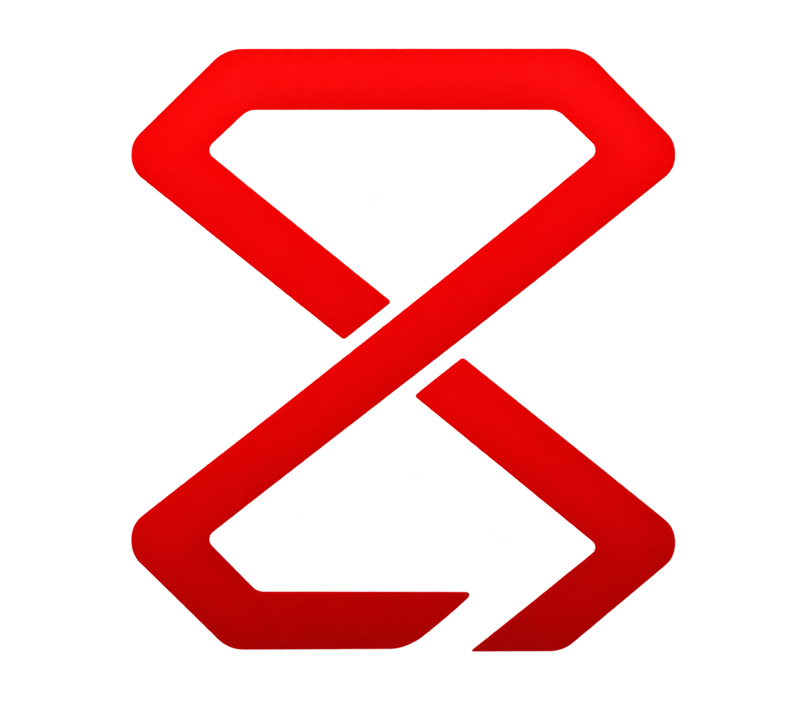

<p align="center">
  
</p>

<h1 align="center">ControlBridge</h1>

<p align="center">
  <a href="LICENSE"></a>
  
</p>

> **Note:** ControlBridge is a feature fork of [PadConnect](https://github.com/Ishan09811/PadConnect) that adds gesture-based button remapping, button combinations, macros, and a visual layout editor on top of the original PadConnect experience.

---

PadConnect is an open-source Android software that transforms your phone into a low-latency virtual Xbox 360 controller for PC. ControlBridge is a fork of PadConnect, What makes ControlBridge unique is its **gesture-based remapping system** — every on-screen button supports **tap and 4-directional swipe gestures**, each independently remappable to any button, button combination, macro sequence, or mode switch. This means you can access controls like RT, RB, LB, LT, R3, and L3 directly through swipe gestures on your existing face buttons — **no need to reach for extra on-screen buttons with your forefingers**.

## Features

### Xbox Layout

- Every button in xbox controller including DPAD, Right and Left Stick, Bumps and triggers.
- Every button is completely Customizable - enable/disable, size, transparency, position.

### Swipe Gesture Remapping

- Every button supports **5 gesture triggers**: Tap, Swipe Up, Swipe Down, Swipe Left, and Swipe Right
- Each gesture can be mapped to a **single button press**, **multi-button combination** (chord), **macro**, or **mode switch**
- For example, map `Swipe Right on A` → `RT + A`, `Swipe Up on X` → `LB + X`, etc.
- Buttons without swipe mappings trigger **instantly at t=0ms** with zero delay
- Configurable swipe sensitivity and swipe-vs-hold delay timing

### Button Combinations

- Trigger **simultaneous multi-button presses** from a single gesture
- Create chords like `RT + B`, `LB + Y`, or `RB + X` — activated for as long as you hold the gesture

### Macro Engine

- Record custom **automated sequences** of button presses, releases, and timed delays
- Assign macros to any button gesture for one-touch combo execution
- Macros run asynchronously and clean up pressed keys automatically on cancel

### Profiles & Modes

- Create **multiple controller profiles** — each with its own button layout and mappings
- Each profile supports **multiple modes** (e.g. "Gameplay" vs "Menu Navigation") with independent gesture maps
- Switch modes **on-the-fly during gameplay** via the HUD dropdown or a remapped gesture
- Optional per-mode **guide text overlay** to display your custom control legend on-screen

### Layout Editor

- **Drag and drop** any button or analog stick to reposition it anywhere on screen
- Adjust **size and opacity** per element or globally
- **Enable/disable** individual buttons you don't need
- **Reset** individual elements or the entire layout to defaults

### Low-Latency Connection

- Automatic **UDP broadcast discovery** — phone and PC find each other on the same Wi-Fi network
- High-rate binary input streaming (**120Hz–1000Hz** configurable)
- Real-time **latency indicator** HUD overlay
- **Haptic rumble feedback** — translates PC rumble motor values into phone vibration

### Material You

- Modern **Material 3** UI with dynamic color theming (Monet) on Android 12+
- Light, Dark, and System-default theme modes
- Full edge-to-edge immersive gameplay experience

---

## Getting Started

### Prerequisites

| Component         | Details                                                                                                                                                       |
| ----------------- | ------------------------------------------------------------------------------------------------------------------------------------------------------------- |
| **Android phone** | Android 10+ (API 29)                                                                                                                                          |
| **PC Receiver**   | [ControlBridgeReceiver](https://github.com/najisheheem05/ControlBridgeReceiver) (Windows / Linux) — **Recommended** (supports up to 4 devices simultaneously) |
| **ViGEm Driver**  | [ViGEmBus](https://github.com/nefarius/ViGEmBus/releases/latest) (Windows only)                                                                               |
| **Network**       | Both devices on the **same Wi-Fi network**                                                                                                                    |

### Setup

1. **Install** ControlBridge app from the releases.
2. **Download** [ControlBridgeReceiver](https://github.com/najisheheem05/ControlBridgeReceiver/releases/latest) on your PC
3. **Install ViGEm driver** (Windows users only) from [ViGEmBus releases](https://github.com/nefarius/ViGEmBus/releases/latest)
4. **Run** ControlBridgeReceiver on your PC
5. **Open** ControlBridge on your phone — it will automatically discover the PC receiver
6. **Create a profile** and start playing!

> [!TIP]
> **Recommended:** Use **[ControlBridgeReceiver](https://github.com/najisheheem05/ControlBridgeReceiver)** on your PC to take full advantage of multi-device connections (up to 4 controllers simultaneously, Player 1–4). The legacy PadConnect receiver can also be used as for single-device setups.

### Quick Customization

- **Edit layout**: Long-press a profile → _Edit Layout_ → Drag buttons, resize, toggle visibility
- **Remap controls**: Long-press a profile → _Remap Controls_ → Pick a button → Pick a gesture → Assign an action
- **Create macros**: Inside Remap Controls → _Manage Macros_ → Build step-by-step sequences

---

## How Swipe Gestures Work

The core idea: instead of cluttering the screen with 12+ buttons, you can **layer multiple actions onto fewer buttons** using directional swipes.

```
                    Swipe Up
                       ↑
                       │
          Swipe Left ← ● → Swipe Right      (● = Tap)
                       │
                       ↓
                    Swipe Down
```

**Each direction is a separate, remappable action.** When you touch a button:

1. If the button has **no swipe mappings** → the tap action fires **instantly** (0ms delay)
2. If the button **has swipe mappings** → a brief configurable window (default 100ms) waits to see if you swipe
   - **Swipe detected** → fires the swipe action immediately, cancels the tap
   - **Quick release** (before the window) → fires a tap pulse
   - **Hold past the window** → fires and holds the tap action (useful for charging/sprinting)

### Example: Mapping RT, RB, LB onto face buttons

| Button | Gesture     | Action |
| ------ | ----------- | ------ |
| A      | Tap         | A      |
| A      | Swipe Left  | RT + A |
| A      | Swipe Right | RT + B |
| A      | Swipe Up    | B      |
| X      | Tap         | X      |
| X      | Swipe Right | RT + X |
| X      | Swipe Down  | RB + X |
| X      | Swipe Up    | LB + X |
| Y      | Tap         | Y      |
| Y      | Swipe Up    | LB + Y |

With this setup, **4 face buttons give you access to 10+ distinct actions** — all reachable with your thumbs. No need to awkwardly reach for shoulder/trigger buttons.

---

## Settings

| Setting             | Description                                           | Default |
| ------------------- | ----------------------------------------------------- | ------- |
| Input Update Rate   | How many times per second input is sent (120–1000 Hz) | 500 Hz  |
| Haptic Feedback     | Phone vibration simulating controller rumble          | Enabled |
| Swipe vs Hold Delay | Time window before touch becomes a hold (50–200 ms)   | 100 ms  |
| Swipe Sensitivity   | Minimum drag distance to register a swipe direction   | 25 px   |
| Show Latency        | Display real-time latency overlay during gameplay     | Enabled |
| Theme Mode          | System / Light / Dark                                 | System  |

---

## Architecture

```
io.github.controlbridge/
├── engine/           # MappingEngine (gesture→action dispatch), MacroEngine (async sequences)
├── input/            # GestureRecognizer (directional swipe detection)
├── models/           # Data models (Profile, Mode, Mapping, Macro, GamepadKey, etc.)
├── profile/          # ProfileStorage (JSON persistence)
├── transport/        # TransportManager, UdpTransport, BleTransport, GamepadTransport
├── ui/
│   ├── main/         # ProfilesScreen, GPEmulationScreen, SetupScreen, AboutScreen
│   ├── remap/        # RemapScreen, MappingEditorSheet, MacroEditorSheet, MacroListScreen
│   └── settings/     # SettingsScreen hierarchy
├── utils/            # DiscoverySender (UDP broadcast), HapticHandler, LoggerService
└── viewmodel/        # GPEmulationViewModel (transport lifecycle & state)
```

**Tech stack:** Kotlin · Jetpack Compose · Material 3 · Kotlin Coroutines · kotlinx.serialization · Navigation Compose

---

## Contributing

Contributions are welcome! To get started:

1. **Fork** the repository
2. **Clone** your fork

   ```bash
   git clone https://github.com/<your-username>/ControlBridge.git
   ```

3. **Create a new branch** for your feature or fix

   ```bash
   git checkout -b feature/your-feature-name
   ```

4. **Make your changes**, commit with clear messages
5. **Push** your branch

   ```bash
   git push origin feature/your-feature-name
   ```

6. **Open a Pull Request** against the `main` branch — describe what you changed and why

Please see [CONTRIBUTING.md](CONTRIBUTING.md) for detailed guidelines and code of conduct.

## License

This project is licensed under the [GNU General Public License v3.0](LICENSE).
